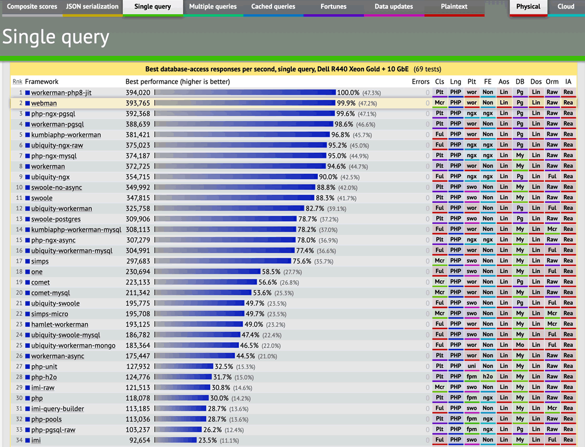
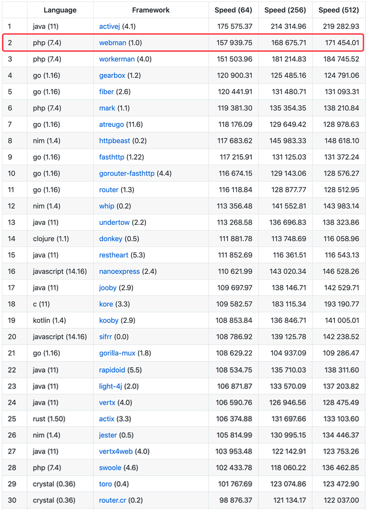

# webman是什么

webman是一款基于[workerman](https://www.workerman.net)开发的高性能HTTP服务框架。webman用于替代传统的php-fpm架构，提供超高性能可扩展的HTTP服务。你可以用webman开发网站，也可以开发HTTP接口或者微服务。

除此之外，webman还支持自定义进程，可以做workerman能做的任何事情，例如websocket服务、物联网、游戏、TCP服务、UDP服务、unix socket服务等等。

# webman具有以下特点

1、高稳定性。webman基于workerman开发，workerman一直是业界bug极少的高稳定性socket框架。

2、超高性能。借助于workerman高性能以及对HTTP服务深入优化，webman性能高于传统php-fpm框架10-100倍左右，同时也远高于其它同类型常驻内存的web框架。

3、高复用。无需修改，可以复用绝大部分composer组件及类库。webman复用了大量laravel组件，也可以选择复用thinkphp等其它框架的组件。

4、高扩展性。支持自定义进程，可以做workerman能做的任何事情。

5、超级简单易用，学习成本极低，代码书写与传统框架没有区别。

6、使用最为宽松友好的MIT开源协议。

# 项目地址
https://github.com/walkor/webman **不要吝啬你的小星星哦**
 
 
 
# 第三方权威压测数据

## [techempower.com](https://www.techempower.com/benchmarks/#section=data-r20&hw=ph&test=db&l=zik073-sf) (带数据库业务)

带数据库查询业务，webman单机吞吐量达到39万QPS，比传统php-fpm架构的laravel框架高出近80倍。

## [the-benchmarker](https://github.com/the-benchmarker/web-frameworks) (纯文本输出，不带业务)

