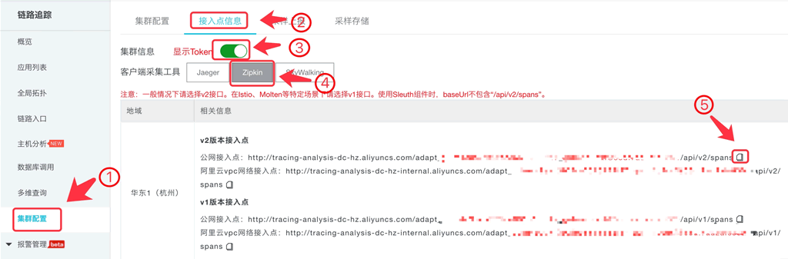
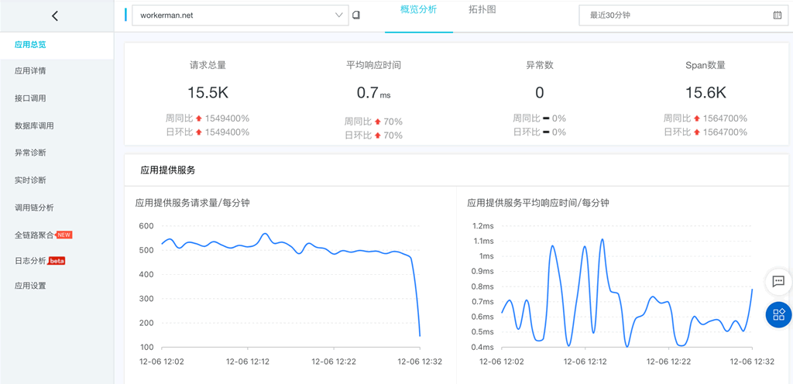
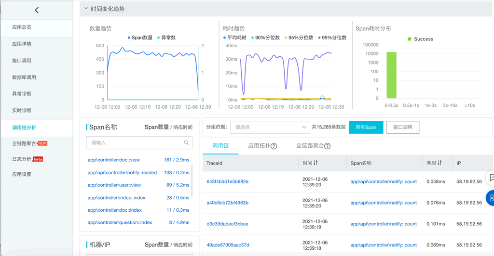

# ARMS 阿里云应用监控(链路追踪)
应用实时监控服务ARMS（Application Real-Time Monitoring Service）是一款阿里云应用性能管理（APM）类监控产品。借助ARMS可以监控webman相关指标如接口请求量、接口耗时、慢调用分析、调用链等。

# 使用方法

## 1、开通ARMS

地址 https://arms.console.aliyun.com/ (一般有14天试用)

## 2、获得数据上报接入点url
进入 https://tracing.console.aliyun.com/#/globalSetting/cn-hangzhou/process 按照图示获得接入点url地址，留作步骤4使用。
> 如果服务器在阿里云上可以用`阿里云vpc网络接入点，本示例用的是阿里云公网接入点



## 3、安装zipkin

```sh
composer require openzipkin/zipkin
```

## 4、创建中间件文件
创建文件 `app/middleware/Arms.php`

```php
<?php
namespace app\middleware;

use Webman\MiddlewareInterface;
use Webman\Http\Response;
use Webman\Http\Request;
use Zipkin\TracingBuilder;
use Zipkin\Samplers\BinarySampler;
use Zipkin\Endpoint;
use Workerman\Timer;

class Arms implements MiddlewareInterface
{
    public function process(Request $request, callable $next) : Response
    {
        static $tracing = null, $tracer = null;
        if (!$tracing) {
            $endpoint = Endpoint::create('workerman.net', $request->getRealIp(), null, 2555);
            $logger = new \Monolog\Logger('log');
            $logger->pushHandler(new \Monolog\Handler\ErrorLogHandler());
            $reporter = new \Zipkin\Reporters\Http([
                'endpoint_url' => '<这里写入步骤2获得的接入点url>'
            ]);
            $sampler = BinarySampler::createAsAlwaysSample();
            $tracing = TracingBuilder::create()
                ->havingLocalEndpoint($endpoint)
                ->havingSampler($sampler)
                ->havingReporter($reporter)
                ->build();
            $tracer = $tracing->getTracer();
            // 30秒上报一次，尽量将上报对业务的影响减少到最低
            Timer::add(30, function () use ($tracer) {
                $tracer->flush();
            });
            register_shutdown_function(function () use ($tracer) {
                $tracer->flush();
            });
        }

        $rootSpan = $tracer->newTrace();
        $rootSpan->setName($request->controller."::".$request->action);
        $rootSpan->start();
        $result = $next($request);
        $rootSpan->finish();

        return $result;
    }
}
```

注意代码中`endpoint_url`设置成步骤2获得的接入点url。

## 5、配置中间件
打开 `config/middleware.php`，在全局中间件位置(key为`''`的位置)添加类似如下配置
```php
return [
    '' => [
        app\middleware\Arms::class,
    ],
];
```

## 6、重启webman
`php start.php restart` 或者 `php start.php restart -d` 。并访问站点。

## 7、查看
访问地址 https://tracing.console.aliyun.com/ ,效果类似如下。
> 为了减少上报对应用的影响，中间件中设置的是30秒统一上报数据，所以阿里云看到结果会有30秒延迟。




## 8、更多内容参考文档
https://help.aliyun.com/document_detail/96187.html