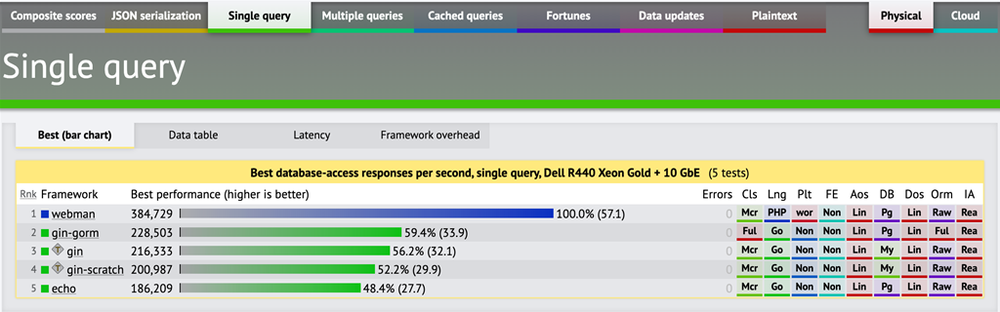

webman هو إطار خدمة HTTP عالية الأداء مبني على [workerman](https://www.workerman.net). تستخدم webman لاستبدال هيكل php-fpm التقليدي، وتوفير خدمة HTTP قابلة للتوسيع بأداء فائق. يمكنك استخدام webman لتطوير مواقع الويب، وكذلك لتطوير واجهات برمجة التطبيقات HTTP أو الخدمات الصغيرة.

بالإضافة إلى ذلك، يدعم webman أيضًا عمليات مخصصة يمكن القيام بها بواسطة workerman، مثل خدمات websocket والإنترنت من الأشياء والألعاب وخدمات TCP وخدمات UDP وخدمات مأخذ Unix وما إلى ذلك.

# مفهوم webman
**تقديم أقصى قدر من القابلية للتوسيع وأفضل أداء من خلال أصغر نواة.**

يوفر webman فقط الوظائف الأساسية (توجيه، وسيطة، جلسة، واجهة عمليات مخصصة). بقية الوظائف تعتمد على بيئة composer، وهذا يعني أنه يمكنك استخدام أكثر العناصر المكونة المألوفة في webman، مثل في مجال قواعد البيانات يمكن للمطورين اختيار استخدام `illuminate/database` من Laravel أو `ThinkORM` من ThinkPHP، وكذلك عناصر أخرى مثل `Medoo`. تكاملهم في webman أمر سهل للغاية.

# webman يتمتع بالميزات التالية

1- استقرار عالي. يُعتمد webman على workerman الذي يعتبر إطارًا للمقابس يتميز بوجود عدد قليل جدًا من الأخطاء.

2- أداء فائق. أداء webman يتفوق على إطار php-fpm التقليدي بمعدل 10 إلى 100 مرة، وأعلى بضعف مقابل إطارات مثل gin وecho في go.

3- قابلية إعادة الاستخدام العالية. يمكن إعادة استخدام معظم مكونات composer ومكتبات الفئات دون الحاجة لأي تعديل.

4- قابلية للتوسيع. دعم العمليات المخصصة، يمكن القيام بكل شيء يمكنه workerman فعله.

5- سهولة الاستخدام الفائقة، تكلفة التعلم منخفضة للغاية، وكتابة الشفرة البرمجية متشابهة تمامًا مع الأطر النمطية التقليدية.

6- يستخدم أفضل وأكثر الرخصية ودية في ترخيص MIT.

# عنوان المشروع
GitHub: https://github.com/walkor/webman **لا تبخل على النجمة الصغيرة**.

Gitte: https://gitee.com/walkor/webman **لا تبخل على النجمة الصغيرة**.

# بيانات قدرات الاختبار الضغط من الجهات الخارجية

مع الاستعلامات إلى قاعدة البيانات، يصل معدل الأداء الخاص بـ webman على جهاز واحد إلى 390000 QPS، أي ما يقرب من 80 مرة أعلى من هيكل php-fpm التقليدي بإطار laravel.

مع الاستعلامات إلى قاعدة البيانات، يكون أداء webman أعلى بمعدل حوالي ضعف إطار الويب في نفس النوعية مع لغة برمجة go.

هذه البيانات مأخوذة من [techempower.com](https://www.techempower.com/benchmarks/#section=data-r20&hw=ph&test=db&l=zik073-sf).
