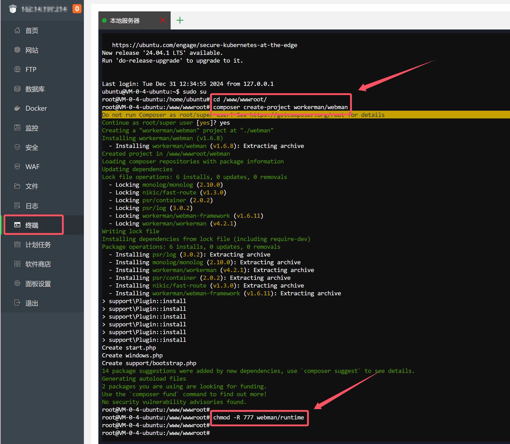
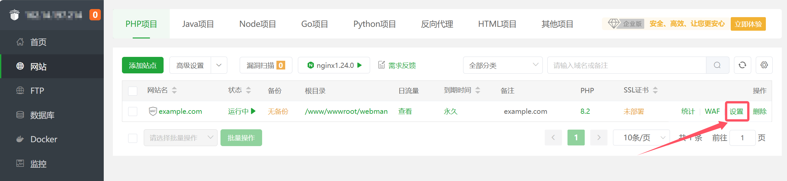
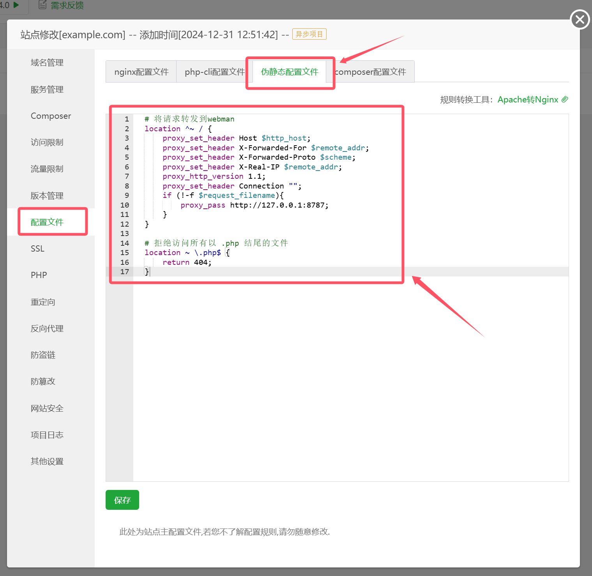
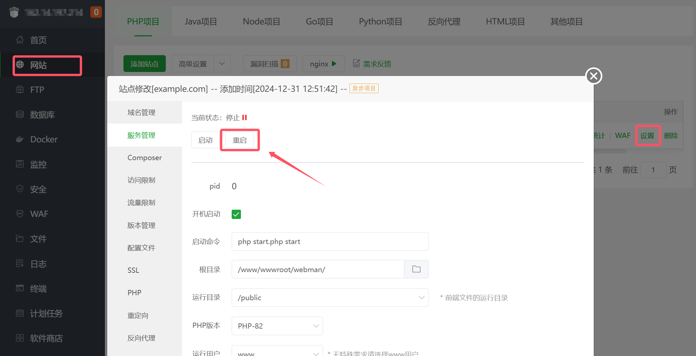
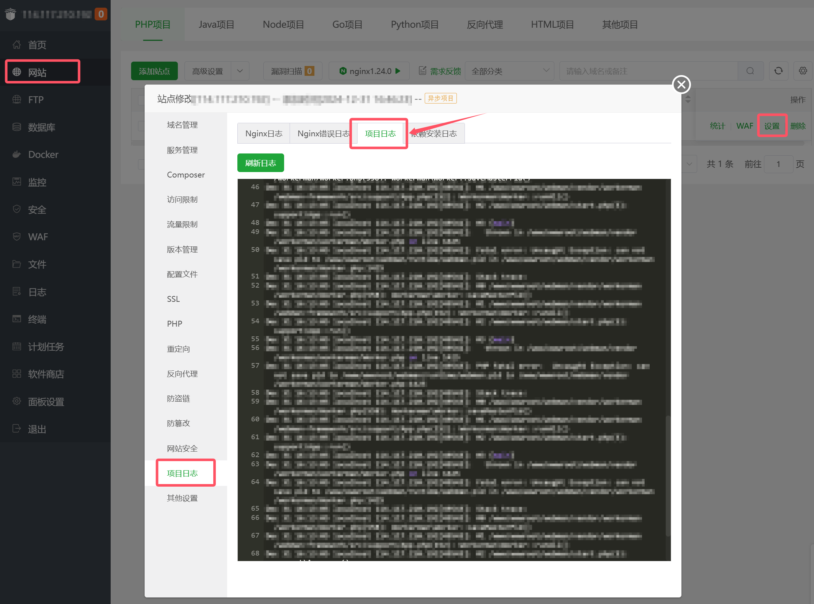

# 宝塔面板安装Webman项目

### 0. 环境要求

* PHP >= 8.1

### 1. 创建项目



```php
cd /www/wwwroot
composer create-project workerman/webman
```

### 2. 设置网站


> **注意：**
> 宝塔会自动守护进程，启动命令为 `php /www/wwwroot/webman/start.php start`，不加 `-d` 参数，否则无法启动


### 3. 配置站点


### 4. 设置运行目录


> **注意：**
> 为了系统安全，运行目录必须设置为 `/public`，错误的设置可能会导致敏感文件被外网访问

### 5. 设置伪静态


```
  # 将请求转发到webman
  location ^~ / {
      proxy_set_header Host $http_host;
      proxy_set_header X-Forwarded-For $remote_addr;
      proxy_set_header X-Forwarded-Proto $scheme;
      proxy_set_header X-Real-IP $remote_addr;
      proxy_http_version 1.1;
      proxy_set_header Connection "";
      if (!-f $request_filename){
          proxy_pass http://127.0.0.1:8787;
      }
  }

  # 拒绝访问所有以 .php 结尾的文件
  location ~ \.php$ {
      return 404;
  }

  # 允许访问 .well-known 目录
  location ~ ^/\.well-known/ {
    allow all;
  }

  # 拒绝访问所有以 . 开头的文件或目录
  location ~ /\. {
      return 404;
  }
```

### 6. 给runtime可写权限



```
chmod -R 777 /www/wwwroot/webman/runtime
```

> **备注**
> 正常不需要此步骤，疑似宝塔bug，服务设置的`www`用户启动，但实际是daemon用户启动，导致无法写入runtime目录

### 7. 重启服务


### 8. 访问站点

访问站点 `http://example.com` 即可看到webman的欢迎页面


## 故障排查

* 站点无法访问提示 502 Bad Gateway
    检查webman是否启动
  
* weman启动失败
    如图所示，检查是否有错误日志
    
