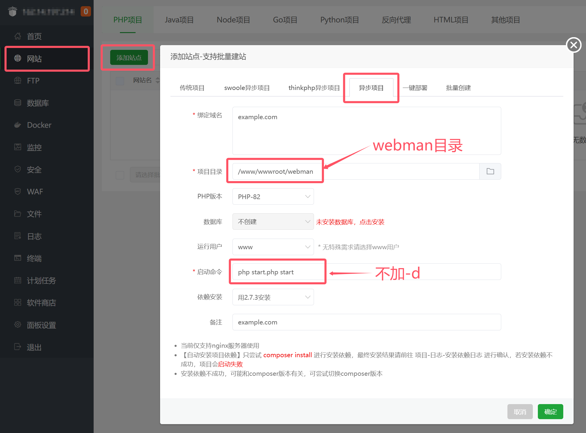
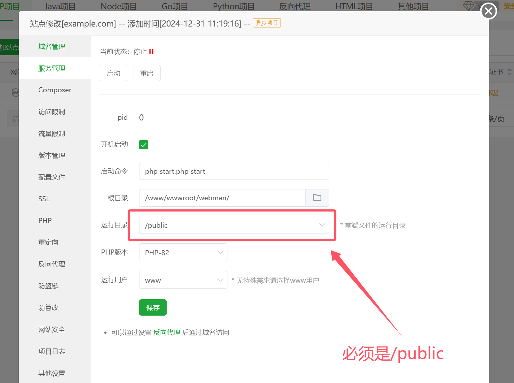
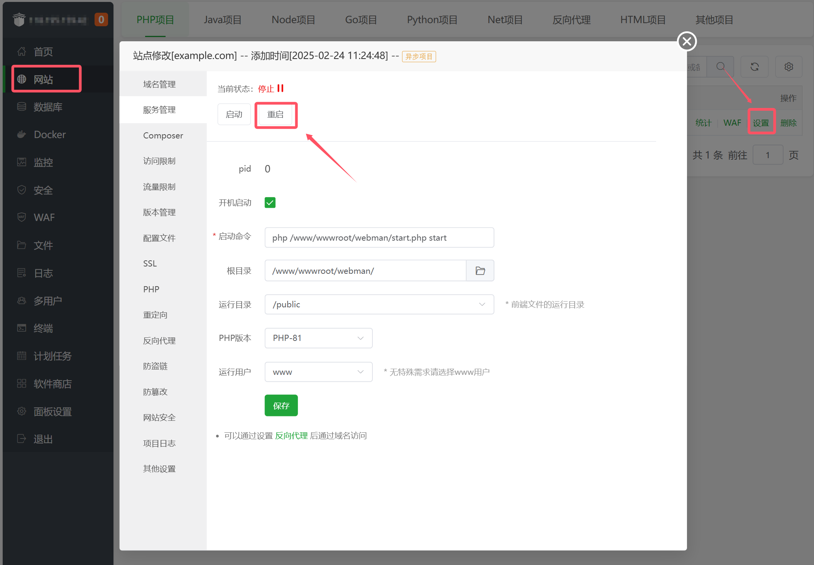

# 宝塔面板安装Webman项目

### 0. 环境要求

* PHP >= 7.2

### 1. 创建项目


```php
cd /www/wwwroot
composer create-project workerman/webman
```

### 2. 设置网站



假设域名为 `example.com`


### 3. 配置站点


### 4. 设置运行目录


**为了系统安全，必须设置为 `/public`**

### 5. 设置伪静态


```
  # 将请求转发到webman
  location ^~ / {
      proxy_set_header Host $http_host;
      proxy_set_header X-Forwarded-For $remote_addr;
      proxy_set_header X-Forwarded-Proto $scheme;
      proxy_set_header X-Real-IP $remote_addr;
      proxy_http_version 1.1;
      proxy_set_header Connection "";
      if (!-f $request_filename){
          proxy_pass http://127.0.0.1:8787;
      }
  }

  # 拒绝访问所有以 .php 结尾的文件
  location ~ \.php$ {
      return 404;
  }
```

### 6. 给runtime可写权限


```
chmod -R 777 /www/wwwroot/webman/runtime
```

### 7. 重启服务



### 8. 访问站点

访问站点 `http://example.com` 即可看到webman的欢迎页面
