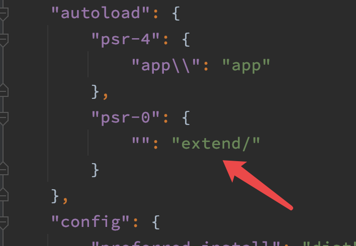

＃ 自動加載

## 利用composer加載PSR-0規範的文件
webman遵循`PSR-4`自動加載規範。如果你的業務需要加載`PSR-0`規範的代碼庫，參考以下操作。

- 新建 `extend` 目錄用於存放`PSR-0`規範的代碼庫
- 編輯`composer.json`，在`autoload`下增加以下內容

```js
"psr-0" : {
    "": "extend/"
}
```
最終結果類似


- 執行 `composer dumpautoload`
- 執行 `php start.php restart` 重啟webman (注意，必須重啟才能生效) 

## 利用composer加載某些文件

- 編輯`composer.json`，在`autoload.files`下添加要加載的文件
```
"files": [
    "./support/helpers.php",
    "./app/helpers.php"
]
```

- 執行 `composer dumpautoload`
- 執行 `php start.php restart` 重啟webman (注意，必須重啟才能生效) 

> **提示**
> composer.json裡`autoload.files`配置的文件在webman啟動前就會加載。而利用框架`config/autoload.php`加載的文件是在webman啟動後才加載的。
> composer.json裡`autoload.files`加載的文件更改後必須restart才能生效，reload不生效。而利用框架`config/autoload.php`加載的文件支持熱加載，更改後reload即可生效。


## 利用框架加載某些文件
有些文件可能不符合SPR規範，無法自動加載，我們可以通過配置`config/autoload.php`加載這些文件，例如：
```php
return [
    'files' => [
        base_path() . '/app/functions.php',
        base_path() . '/support/Request.php', 
        base_path() . '/support/Response.php',
    ]
];
```
 > **提示**
 > 我們看到`autoload.php`裡設置了加載 `support/Request.php` `support/Response.php`兩個文件，這是因為在`vendor/workerman/webman-framework/src/support/`下也有兩個相同的文件，我們通過`autoload.php`優先加載項目根目錄下的`support/Request.php` `support/Response.php`，這樣允許我們可以定製這兩個文件的內容而不需要修改`vendor`中的文件。如果你不需要定製它們，則可以忽略這兩個配置。

